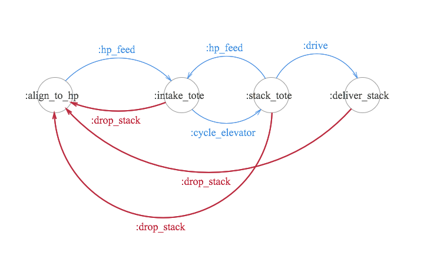
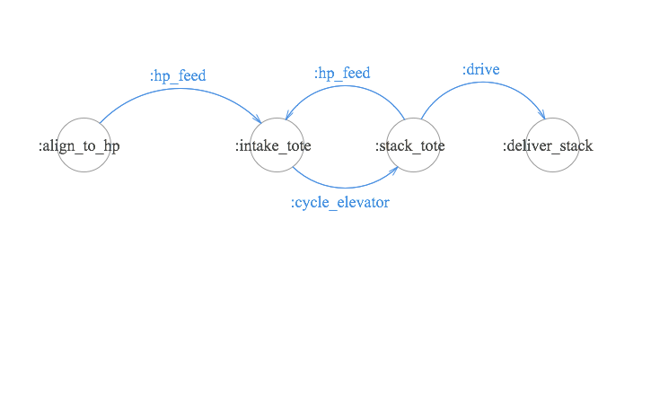
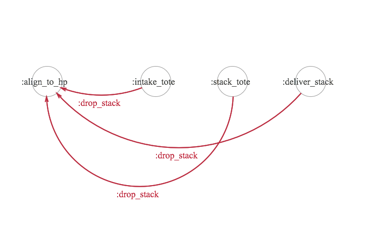

## Using FSMs to Model Game Activities

Today, we're going to build a simple FSM to model the FRC2015 game, Recycle Rush. I'm going to focus on the part of the game I know, so we're going to build a FSM for a HP loaded stacker. I'm also going to introduce the concept of multiple possible transitions from a single state.

### The State Machine
Last time I wrote out all the states and transitions, today I'm going to skip that and provide a simple diagram. You'll notice it's a fair bit more complicated than before. I've also eliminated a lot of states (such as collecting cans and driving  to the HP station). The diagram started getting cramped so those events and states are left as exercises for the reader.



I was nice and color coded it for you; Blue denotes the good path through the system. Red denotes bad paths. Let's get started coding...


### The Good
We're going to start with the good options. I've separated those out below.



Like last time, we're going to write tests and then write the code to make the tests work. This is called Test Driven Development. Why write tests first? Because otherwise you'll never write them. Why write tests? Because when these start getting more complicated you want to have simple tests to verify behavior.

```elixir
    # test/frc2015_fsm_test.exs
    defmodule Frc2015FsmTest do
      use ExUnit.Case

      test "we start aligned to the human player" do
        assert Robot.new.state == :align_to_hp
      end

      test "we should intake a tote after we hp_feed" do
        bot = Robot.new |> Robot.hp_feed
        assert bot.state == :intake_tote
      end

      test "after intaking a tote we should cycle the elevator to stack the tote" do
        bot = Robot.new |> Robot.hp_feed |> Robot.cycle_elevator
        assert bot.state = :stack_tote
      end

      test "after stacking a tote we should intake another tote" do
        bot = Robot.new
           |> Robot.hp_feed
           |> Robot.stack_tote
           |> Robot.hp_feed
        assert bot.state = :intake_tote
      end

      # And now the things we can't do...

      test "we can't cycle elevator until we've got a tote" do
        assert_raise FunctionClauseError, fn ->
          Robot.new |> Robot.cycle_elevator
        end
      end

      test "we can't hp_feed once we are intaking a tote" do
        assert_raise FunctionClauseError, fn ->
          Robot.new
            |> Robot.hp_feed
            |> Robot.hp_feed
          end
      end
    end


```

Ok, cool, we've gotten the good path mostly tested. The only thing I wanted to draw attention to before finishing off those tests is the fact that :stack_tote actually has two possible transitions and we aren't testing them. Good news is, it's pretty simple.

``` elixir
# test/frc2015_fsm_test.exs

    test "we can drive to deliver a stack" do
      bot = Robot.new
         |> Robot.hp_feed
         |> Robot.cycle_elevator
         |> Robot.drive
      assert bot.state == :deliver_stack
    end
```

And the code to make it pass...

```elixir
# lib/frc2015_fsm.ex

    defstate stack_tote do
      defevent hp_feed do
        next_state :intake_tote
      end
      defevent drive do
          next_state :deliver_stack
      end
    end
```

### The Bad




Ok, I've gone ahead and implemented the appropriate tests for the bad, no reason to pad the word count of the article, if you're interested see the github repository, it's all pretty straightforward. I just wanted to show folks a good process for developing these once they get more complicated.


### The Steps

If you only take away one piece of this article, this is it.

1. Identify the states you can be in
2. Identify the transitions between them
3. Draw a picture
4. Write tests for the states and transitions
5. Write the supporting code


### Next Steps

Hey, wouldn't it be nice if the state machine could have some sense of, I don't know, state? In our case, how do we know how many times to loop at the human player station? To do that we're going to add some data to each state to track how many totes it has.

```elixir
    # lib/frc2015_fsm.ex
    use Fsm, initial_state: :align_to_hp, initial_data: 0
```
And supporting test
```elixir
    # test/frc2015_fsm_test.exs
    test "initially we have 0 totes" do
      assert Robot.new.data == 0
    end

    test "cycling the elevator increments our totes" do
      bot = Robot.new
         |> Robot.hp_feed
         |> Robot.cycle_elevator
      assert bot.data == 1
    end

```

Changing the cycle elevator method to update the data...

```elixir
    # lib/frc2015_fsm.ex
    defevent cycle_elevator, data: totes do
      if totes >= 6 do
        raise "Stack Too High"
      end
      next_state :stack_tote, totes + 1
    end
```


There's also a couple tests added for when you stack too high in the source, check it out if you're curious. If you've read this far you're probably starting to see where we're going with this. So far, we've built a reasonably functional state machine for a robot's behavior. The next article is going to focus on actually figuring out how many points this robot could score in a match. And will give you a framework to build other options in. The important thing I want to make sure everyone knows, this analysis is not intended to be done after the season, it's meant to be done the first few days of kickoff. While there seems to be a lot of code here, most of it was written in a couple of hours while writing this article (the article and the code are actually written simultaneously so I know I don't miss anything). It's absolutely doable the day after kickoff to have several models set up that you can tweak parameters on.


#### Bonus

Ok, common question - how do I know if I tested what needs to be tested. That's called code coverage, I've added a library called [excoveralls](https://github.com/parroty/excoveralls) to this repo. You can run it with ```MIX_ENV=test mix coveralls``` (you'll have to ```mix deps.get``` first) and it'll tell you the code coverage. The higher this is, the better your tests are.


As always, the code is available over on [github](https://github.com/schreiaj/frc2015_fsm). 
